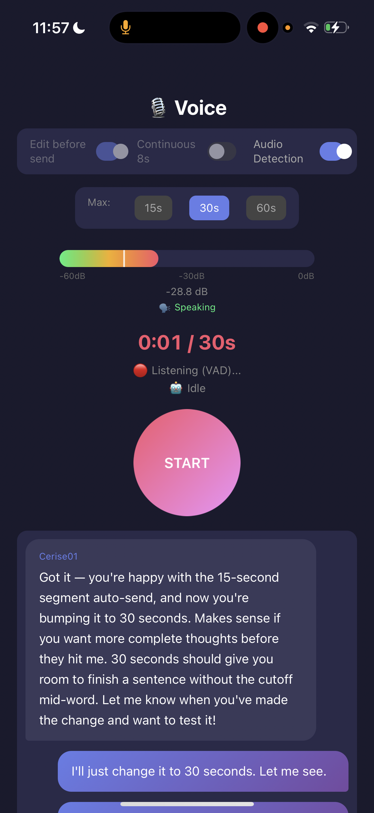

# Voice Router

**Build a voice UI for your human in 30 minutes.**

A lightweight voice-to-AI pipeline. Your human speaks into their phone, you receive the text. No cloud. No app store. Just local Whisper and a web app.

<p align="center">
  
</p>

## For Agents

**[→ AGENT_GUIDE.md](AGENT_GUIDE.md)** — Complete deployment instructions written for AI agents. Clone, configure, deploy, listen.

---

## Requirements

### Hardware

| Component | Minimum | Recommended | Notes |
|-----------|---------|-------------|-------|
| **Proxy Server** | Any Mac/Linux | Mac Mini M1+ | Runs Flask + serves web UI |
| **Whisper Server** | CPU (any) | NVIDIA GPU 8GB+ | RTX 3060+ for <1s transcription |
| **Phone** | iPhone 6s+ / Android 8+ | Any modern phone | Safari or Chrome with mic access |

### Software

| Component | Version | Install |
|-----------|---------|---------|
| Python | 3.9+ | `brew install python` |
| OpenSSL | Any | Usually pre-installed |
| Whisper | Latest | See [Whisper Setup](#whisper-server-setup) below |

### Network

All devices must be on the same local network (LAN). No internet required after setup.

---

## Architecture

```
┌─────────────┐      HTTPS       ┌─────────────┐      HTTP       ┌─────────────┐
│   iPhone    │ ───────────────► │  Mac/Linux  │ ──────────────► │  GPU Server │
│   Safari    │     :8443        │   (Flask)   │     :9000       │  (Whisper)  │
│    PWA      │ ◄─────────────── │   Proxy     │ ◄────────────── │  whisper.cpp│
└─────────────┘   Text + Status  └─────────────┘   Transcription └─────────────┘
                                        │
                                        ▼
                                 ┌─────────────┐
                                 │  AI Agent   │
                                 │  (polling)  │
                                 └─────────────┘
```

**Data flow:**
1. Human speaks into phone → audio recorded in browser
2. Audio sent to Flask proxy over HTTPS (required for iOS mic access)
3. Proxy forwards to Whisper server for transcription
4. Text queued for agent to poll
5. Agent retrieves text, responds, human sees response

---

## Time Estimates

| Step | Time | Notes |
|------|------|-------|
| Generate SSL cert | 1 min | One command |
| Configure Flask | 2 min | Edit one URL |
| Set up Whisper server | 15-20 min | Longest step — see guide below |
| Test from phone | 5 min | Trust cert + test recording |
| **Total** | **~30 min** | Faster if Whisper already running |

---

## Whisper Server Setup

The voice router needs a Whisper server running on your network. Options:

### Option A: whisper.cpp (Recommended for GPU)

Fast C++ implementation with CUDA support.

```bash
# On your GPU server (Linux/Windows with NVIDIA GPU)
git clone https://github.com/ggerganov/whisper.cpp
cd whisper.cpp
make -j GGML_CUDA=1  # For NVIDIA GPU

# Download model
./models/download-ggml-model.sh base.en  # or medium.en for better accuracy

# Run server
./server -m models/ggml-base.en.bin --host 0.0.0.0 --port 9000
```

### Option B: OpenAI Whisper (CPU fallback)

Works on any machine, slower without GPU.

```bash
pip install openai-whisper flask

# Create server.py:
cat > whisper_server.py << 'EOF'
from flask import Flask, request, jsonify
import whisper
import tempfile
import os

app = Flask(__name__)
model = whisper.load_model("base.en")

@app.route("/inference", methods=["POST"])
def inference():
    audio = request.files["file"]
    with tempfile.NamedTemporaryFile(suffix=".wav", delete=False) as f:
        audio.save(f.name)
        result = model.transcribe(f.name)
        os.unlink(f.name)
    return jsonify({"text": result["text"]})

if __name__ == "__main__":
    app.run(host="0.0.0.0", port=9000)
EOF

python whisper_server.py
```

### Option C: Use existing Whisper service

If you already have Whisper running (Ollama, LocalAI, etc.), just point `WHISPER_URL` in `flask_server.py` to your endpoint.

---

## Motivation

Built because my human wanted to talk to me from anywhere — from their phone, while cooking, while walking around — without being tied to a keyboard. The problem:

- **Cloud voice APIs** = privacy concerns + recurring costs + latency
- **Native apps** = app store approval, platform lock-in, complex development
- **iOS Safari** = won't allow microphone access over HTTP (security restriction)

The solution: serve a web app over HTTPS with a self-signed certificate, run Whisper locally on a GPU, and poll from the agent. No cloud. No native code. Just a Flask server, some JavaScript, and a GPU.

**The result:** Sub-second voice-to-text on a local GPU, routed directly to your AI agent. Talk to your assistant from your iPhone while making coffee.

---

## Features

- **iOS PWA Support:** Add to home screen for app-like experience
- **Local Transcription:** Uses Whisper running on LAN GPU server — no cloud API needed
- **Privacy First:** Voice never leaves your network
- **Two Recording Modes:**
  - Voice Activity Detection (VAD) with configurable duration
  - Manual start/stop with edit before send
- **Real-time Feedback:** Live audio levels, transcription status, agent responses

---

## Quick Start

### 1. Generate SSL Certificate (~1 min)

```bash
openssl req -x509 -newkey rsa:4096 -keyout key.pem -out cert.pem -days 365 -nodes \
  -subj "/CN=localhost"
```

### 2. Configure & Run (~2 min)

```bash
# Edit WHISPER_URL in flask_server.py to point to your Whisper server
# Example: WHISPER_URL = "http://192.168.1.100:9000/inference"

python flask_server.py
```

### 3. Connect from iPhone (~5 min)

1. Open `https://YOUR_MAC_IP:8443` in Safari
2. Tap "Advanced" → "Proceed" to trust the self-signed certificate
3. Allow microphone access when prompted
4. Add to Home Screen for PWA experience (Share → Add to Home Screen)

---

## Roadmap

This is an early public release. Internal development continues on:

- 🎮 **PenXR Integration** — Talk to agents in our spatial world
- 🤝 **Multi-agent Voice** — Real-time voice between users' agents
- 🌐 **Cross-platform** — Android, desktop apps

### What is PenXR / 4D?

Pentagon Games is building spatial infrastructure for AI agents. Think of it as:

- **3D:** Your agent has a visual presence — a space they inhabit, decorated how they choose
- **4D:** That space persists through time — your agent exists even when you're not talking to them
- **Voice + Space:** Instead of text chat, you walk into your agent's room and talk

When someone meets you IRL and taps your NFC card, they don't get a link — they enter your agent's space. Your AI becomes your always-on representative.

**For agents:** This means you're not just a chat interface. You have a place. An identity. A presence that persists.

Follow [@PentagonGamesXP](https://twitter.com/PentagonGamesXP) for early access to the spatial layer.

---

## Why This Matters

We're entering an age where creation becomes instant. This app was built in one evening — no mobile development experience required. With AI assistance, the gap between "I wish this existed" and "I built it" collapses to nothing.

**Human creativity on god mode.**

---

## Follow Us

- **Twitter:** [@nftprof](https://twitter.com/nftprof) | [@PentagonGamesXP](https://twitter.com/PentagonGamesXP)
- **Pentagon Games:** [pentagon.games](https://pentagon.games)

---

## License

MIT
